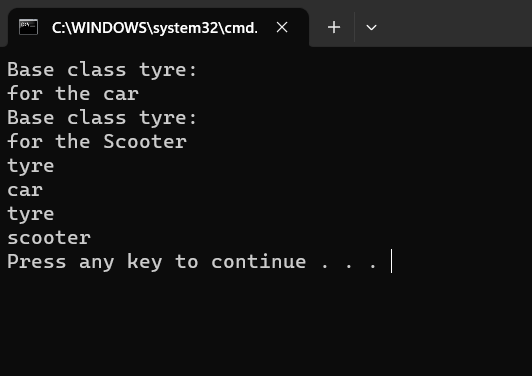

# Inheritance

## Aim:
To write a C# program to print some messages using hierarchical inheritance
## Algorithm:
### step 1:
Create a base class.

### step 2:
Create two child class.

### step 3:
Create a constructor in the base class and print a message.

### step 4:
create a function in child class to print a message.
## Program:
```
using System;
namespace ex8

{
    public class tyre
    {
        public tyre()
        {
            Console.WriteLine("Base class tyre:");
        }
        public virtual void Display()
        {
            Console.WriteLine("tyre");
        }

    }
    public class scooter : tyre
    {
        public scooter()
        {
            Console.WriteLine("for the Scooter");
        }
        public override void Display()
        {
            base.Display();
            Console.WriteLine("scooter");
        }
    }
    public class car : tyre
    {
        public car()
        {
            Console.WriteLine("for the car");
        }
        public override void Display()
        {
            base.Display();
            Console.WriteLine("car");
        }
    }
    public class program
    {
        static void Main(string[] args)
        {
            car car = new car();
            scooter scooter = new scooter();
            car.Display();
            scooter.Display();

        }
    }
}
```

## Output:


## Result
Thus C# program to print some messages using hierarchical inheritance is written and executed sucessfully.
